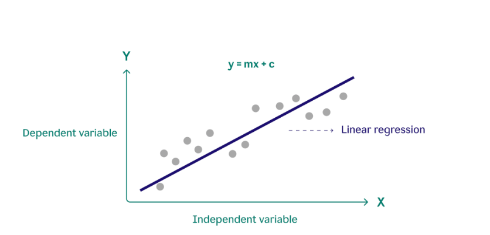
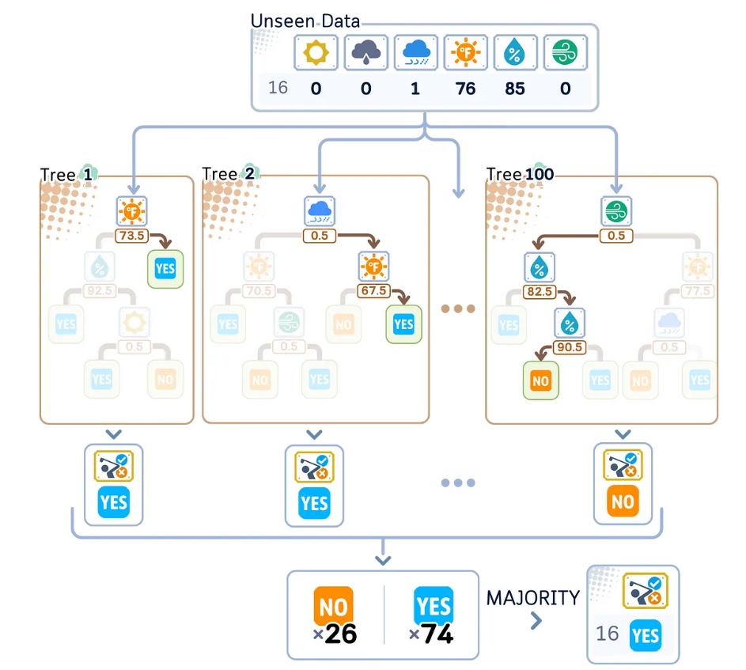

# Part 2: The Toolkit - Building the Predictive Models

## Goal
Introduce two common but powerful regression models, starting with a simple one and moving to a more complex one.

---

## Model 1: Linear Regression

### What You Need to Know
Linear regression is the "hello world" of machine learning. It's the simplest way to find relationships between your data.

**The Basic Formula**: y = mx + b
- **y**: The prediction you want to make
- **x**: Your input feature (like yesterday's stock price)
- **m**: The weight (how much influence x has)
- **b**: The bias (the starting point)

*This graph shows how linear regression finds the best straight line through data points. The line represents the model's predictions, and the distance from points to the line shows prediction errors.*

### How It Works
Think of it as drawing the best possible straight line through your data points.

**Simple Example**:
- X-axis: Yesterday's stock price
- Y-axis: Today's stock price
- The line shows the relationship between them

### Visual Analogy
Imagine you're looking at a scatter plot of dots on a graph. Linear regression finds the straight line that comes closest to touching all those dots. Once you have that line, you can use it to predict where new dots should fall.

### Strengths
- **Simple to understand**: You can see exactly how it makes decisions
- **Fast to train**: Processes data quickly
- **Explainable results**: Shows the weight given to each feature
- **No "black box"**: The formula is completely transparent

### Weaknesses
- **Assumes linear relationships**: Only draws straight lines
- **Too simple for complex patterns**: Real financial markets are rarely linear
- **Limited flexibility**: Can't capture curved or complex relationships

### Financial Example
**Predicting daily sales for a retail store**
- Input: Yesterday's sales, day of week, weather
- Output: Today's expected sales
- The model might learn: "Today's sales = 0.8 × yesterday's sales + 200 extra on Fridays + 50 less when raining"

---

## Model 2: Random Forest Regression

### What You Need to Know
Random Forest is a much more sophisticated approach. Instead of one straight line, it builds hundreds or thousands of "decision trees."

**Key Concept**: Each tree is like a flowchart of "if-then" questions based on your features.

### Visual Example: Decision Tree Flowchart

Here's a simple example of how a decision tree might make decisions for predicting weather:

*This flowchart shows how a single decision tree might predict sales based on multiple factors. A Random Forest creates hundreds of such trees, each asking different questions, then averages their predictions for the final result.*

### How It Works
The process happens in three steps:

1. **Build many decision trees**: Each tree asks different questions about your data
2. **Get predictions from all trees**: Every tree makes its own prediction
3. **Average the results**: The final prediction is the average of all tree predictions

### The "Wisdom of Crowds" Analogy
Imagine you're trying to estimate the price of a house:

**Single Expert (One Tree)**:
- One real estate agent gives you their opinion
- Might be biased or miss important factors

**Panel of Experts (Random Forest)**:
- 100 different real estate agents each give their opinion
- Some focus on location, others on size, others on market trends
- The average of all opinions is usually more accurate than any single opinion

### How Each Tree Makes Decisions
Each decision tree asks questions like:
- "Is the house bigger than 1,500 sq ft?"
  - If YES: "Does it have a pool?"
  - If NO: "Is it in a good school district?"
- And so on, creating a branching flowchart

### Strengths
- **Captures complex relationships**: Can handle curved and non-linear patterns
- **Very accurate**: Generally produces highly accurate predictions
- **Robust**: Less likely to be fooled by outliers or noise
- **Handles different data types**: Works with numbers, categories, and mixed data

### Weaknesses
- **Less interpretable**: Hard to see the exact formula or reasoning
- **Computational power**: Requires more processing time and memory
- **Black box nature**: Difficult to explain why it made a specific prediction

### Financial Example
**Predicting credit card default risk**

**Tree 1 might ask**:
- "Is income > $50,000?" → "Is debt-to-income < 30%?" → Predict: Low risk

**Tree 2 might ask**:
- "Any late payments in last 6 months?" → "Is credit utilization > 80%?" → Predict: High risk

**Tree 3 might ask**:
- "Length of credit history > 5 years?" → "Number of credit cards < 4?" → Predict: Medium risk

**Final prediction**: Average of all tree predictions gives a nuanced risk score that considers multiple factors simultaneously.

---

## Choosing Between Models

### Use Linear Regression When:
- You need to explain your predictions to stakeholders
- You have simple, mostly linear relationships
- Speed is more important than perfect accuracy
- You're starting with a baseline model

### Use Random Forest When:
- You need maximum accuracy
- Your data has complex, non-linear patterns
- You have enough computational resources
- Explainability is less critical than performance